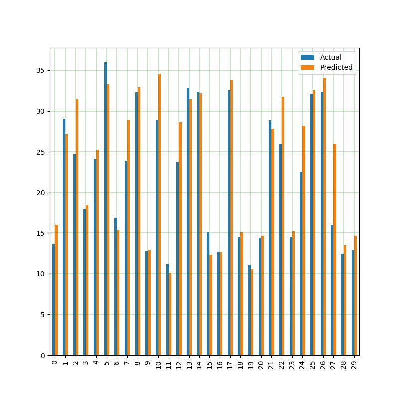

# Simple Linear Regression ML project

Goal: Predict heating load of different buildings based on shape characteristics

Attributes and coefficients found

| Attribute | Coefficient |
| --- | --- |
Relative Compactness  |-6.349559e+01
Surface Area  |-5.163968e+11
Wall Area  |5.163968e+11
Roof Area  |1.032794e+12
Overall Height  |4.262313e+00
Orientation  |1.655293e-02
Glazing Area  |2.004356e+01
Glazing Area Distribution  |1.430449e-01

Results:   
Mean heating load(actual): 22.307  
Mean Absolute Error: 1.8781634876621587  
Mean Squared Error: 6.849160350020629  
Root Mean Squared Error: 2.617090053861469  
RMSE % of mean(actual): 11.73%

Dataset source: https://archive.ics.uci.edu/ml/datasets/Energy+efficiency

  
pip list

  
| Package | Version |
| --- | --- |
-absl-py             |0.8.0
-astor               |0.8.0
gast                 |0.2.2
google-pasta         |0.1.7
grpcio               |1.24.1
h5py                 |2.10.0
joblib               |0.14.0
Keras                |2.3.0
Keras-Applications   |1.0.8
Keras-Preprocessing  |1.1.0
Markdown             |3.1.1
numpy                |1.17.2
opt-einsum           |3.1.0
pandas               |0.25.1
pip                  |19.2.3
protobuf             |3.10.0
python-dateutil      |2.8.0
pytz                 |2019.2
PyYAML               |5.1.2
scikit-learn         |0.21.3
scipy                |1.3.1
setuptools           |41.2.0
six                  |1.12.0
sklearn              |0.0
tensorboard          |2.0.0
tensorflow           |2.0.0
tensorflow-estimator |2.0.0
termcolor            |1.1.0
virtualenv           |16.7.5
Werkzeug             |0.16.0
wheel                |0.33.6
wrapt                |1.11.2
xlrd                 |1.2.0

